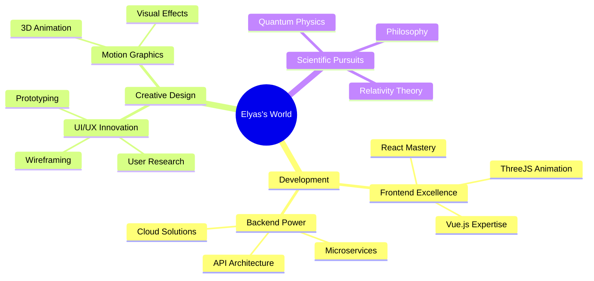

<div align="center">


[](https://github.com/elyas-malaeka)
[](README_FA.md)

<a href="https://git.io/typing-svg"></a>

</div>

<div align="center">

</div>

## 💫 About Me

```javascript
const elyas = {
    location: "Dubai, UAE 🌇",
    roles: ["Full-Stack Developer", "UI/UX Designer", "Motion Designer"],
    worksWith: {
        languages: ["JavaScript", "Python", "PHP", "HTML5", "CSS3"],
        frameworks: ["React", "Vue.js", "Laravel", "Django"],
        databases: ["MySQL", "MongoDB", "PostgreSQL"],
        tools: ["Git", "Docker", "AWS", "Firebase"]
    },
    creativeSuite: {
        design: ["Figma", "Photoshop", "Illustrator", "InDesign"],
        motion: ["After Effects", "Premiere Pro"],
        prototyping: ["Principle", "ProtoPie"]
    },
    interests: ["Quantum Physics", "Theory of Relativity", "Philosophy"],
    currentlyLearning: ["Machine Learning", "ThreeJS", "WebGL"],
    funFact: "I believe creativity is intelligence having fun! 🎨"
};
```

## 🎯 Expertise

<table align="center">
<tr>
<td align="center" width="50%">

### 🎨 Creative Arsenal

<br/>


</td>
<td align="center" width="50%">

### 💻 Tech Stack

<br/>


</td>
</tr>
</table>

## 🚀 Current Journey

<div align="center">



</div>

## 📊 GitHub Statistics

<div align="center">

</div>

<table>
  <tr>
    <td width="50%">
      
    </td>
    <td width="50%">
      
    </td>
  </tr>
  <tr>
    <td colspan="2">
      
    </td>
  </tr>
</table>

## 🌐 Let's Connect

<div align="center">

[](https://your-portfolio.com)
[](https://t.me/elyas_malaeka)
[](https://www.behance.net/elyas_malaeka)
[](https://dribbble.com/elyas-malaeka)
[](https://www.figma.com/@elyas_malaeka)
[](https://linkedin.com/in/your-profile)
[](mailto:Elyasmalaeka@gmail.com)

### 📫 Drop a line at [Elyasmalaeka@gmail.com](mailto:Elyasmalaeka@gmail.com)

</div>

## 🎵 Vibing to

<div align="center">

[](https://github.com/kittinan/spotify-github-profile)

</div>


<div align="center">


### Show some ❤️ by starring repositories that you find good!
</div>
