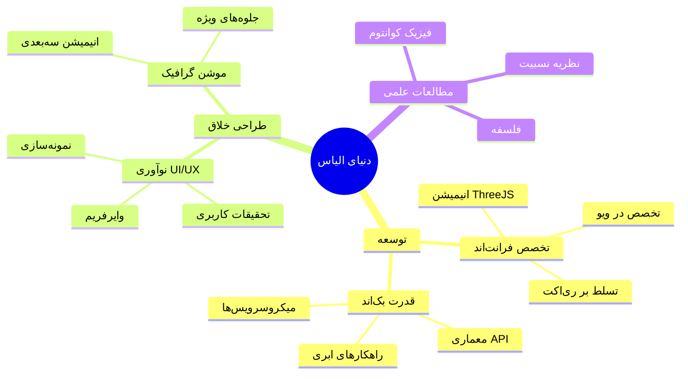

<div align="center" dir="rtl">


[](https://github.com/elyas-malaeka)
[](README.md)

<a href="https://git.io/typing-svg"></a>

</div>

<div align="center">

</div>

## 💫 درباره من

```javascript
const elyas = {
    موقعیت: "دبی، امارات متحده عربی 🌇",
    نقش‌ها: ["توسعه‌دهنده فول‌استک", "طراح UI/UX", "موشن دیزاینر"],
    مهارت‌های_فنی: {
        زبان‌ها: ["جاوااسکریپت", "پایتون", "پی‌اچ‌پی", "HTML5", "CSS3"],
        فریم‌ورک‌ها: ["ری‌اکت", "ویو", "لاراول", "جنگو"],
        پایگاه‌داده: ["مای‌اس‌کیو‌ال", "مونگو‌دی‌بی", "پستگرس"],
        ابزارها: ["گیت", "داکر", "AWS", "فایربیس"]
    },
    ابزارهای_طراحی: {
        طراحی: ["فیگما", "فتوشاپ", "ایلوستریتور", "این‌دیزاین"],
        موشن: ["افترافکتس", "پریمیر پرو"],
        نمونه‌سازی: ["پرینسیپل", "پروتوپای"]
    },
    علایق: ["فیزیک کوانتوم", "نظریه نسبیت", "فلسفه"],
    در_حال_یادگیری: ["یادگیری ماشین", "ThreeJS", "WebGL"],
    نکته_جالب: "معتقدم خلاقیت، هوشی است که تفریح می‌کند! 🎨"
};
```

## 🎯 تخصص‌ها

<table align="center" dir="rtl">
<tr>
<td align="center" width="50%">

### 🎨 ابزارهای خلاقیت

<br/>


</td>
<td align="center" width="50%">

### 💻 فناوری‌ها

<br/>


</td>
</tr>
</table>

## 🚀 مسیر کنونی

<div align="center" dir="rtl">



</div>

## 📊 آمار گیت‌هاب

<div align="center" dir="rtl">

[](https://github.com/ryo-ma/github-profile-trophy)

 

[](https://github.com/ashutosh00710/github-readme-activity-graph)

### 📱 ارتباط و دنبال کردن

[](https://t.me/elyas_malaeka)
[](https://www.behance.net/elyas_malaeka)
[](https://dribbble.com/elyas-malaeka)
[](https://www.figma.com/@elyas_malaeka)

### 💌 تماس با من
[](mailto:Elyasmalaeka@gmail.com)

### 💭 سخن حکیمانه
<div align="center">

### *"ارزش هر کس به اندازه‌ای است که در آن مهارت و تخصص دارد."*
### *– امیرالمؤمنین، امام علی (ع)*

</div>


</div>
